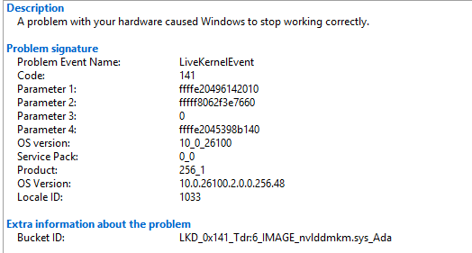
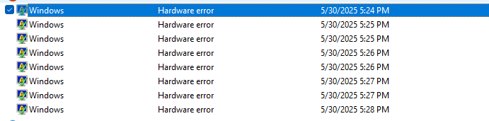
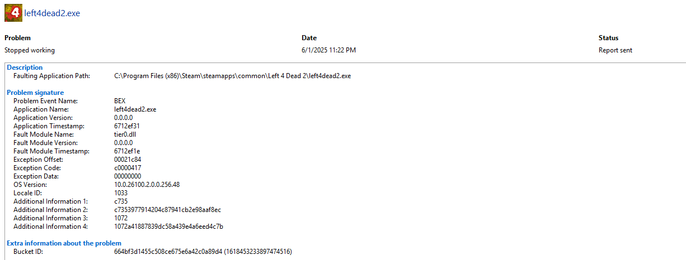

# 🧪 Lab: Remote Diagnosis and Resolution of GPU Hang on Gaming Laptop

## 🎯 Objective

To remotely diagnose and resolve repeated GPU hangs and system freezes during gameplay on a client’s laptop using structured troubleshooting methods, driver rollback, and benchmark testing.

---

## 🖥️ Hardware Specifications

**Device Type**: Katana 17 B13VGK
**GPU**: NVIDIA® GeForce RTX™ 4070 Laptop GPU 8GB GDDR6
**CPU**: Up to 13th Gen Intel® Core™ i7 Processor
**RAM**: 64 GBs DDR5-5200
**Operating System**: Windows 11
**Max GPU Temp Observed**: 86°C

---

## ❗ Error Analysis

### 🔻 LiveKernelEvent Code 141

* **Description**: Indicates a hardware-related error, usually tied to GPU timeout or crash.
* **Impact**: Typically occurs when the system's graphics card stops responding and Windows fails to recover it in time.
* **Common Causes**:

  * Faulty or unstable GPU drivers
  * GPU overheating
  * Insufficient power or system instability
  
 

### 🔻 Event ID 10029 (System Log)

* **Description**: A low-level system error often tied to hardware readiness or driver failure.
* **Impact**: Signals a timeout or failure during a system or driver initialization process.
* **Common Causes**:

  * Faulty hardware communication
  * Driver crashes or hangs

 

### 🔻 Event ID 78 and BEX (Application Log)

* **Description**: A user-mode application error; in this context, likely caused by a game or driver service failure.
* **Impact**: May result in the crashing of an application (e.g., Marvel Rivals, Left 4 Dead 2)
* **Common Causes**:

  * Crashes in GPU-intensive applications
  * Bad game patches or unstable drivers

 

---

## 🔧 Step-by-Step Process

### 1. Remote Access Initiated

* Tool: **AnyDesk**
* Goal: Full visibility into system errors and configuration

### 2. Error Documentation

* Captured screenshots from:

  * **Reliability Monitor**
  * **Event Viewer** (for Codes 141, 10029, and 78)

### 3. Pre-Fix Testing

* Tool: **Unigine Heaven Benchmark**
* Observed GPU temp at 86°C with minor stutters

### 4. Power Management Adjustments

* Set NVIDIA Control Panel Power Mode to **Maximum Performance**
* Set CPU power profile to **100% min/max**

### 5. Issue Reproduced

* Game crash confirmed during Marvel Rivals character select

### 6. Driver Rollback

* Downloaded and ran **DDU** in Safe Mode
* Located laptop’s exact model to match driver version
* Installed **older stable NVIDIA driver**

### 7. Post-Fix Testing

* Retested Marvel Rivals
* Played multiple games with no crashing or stuttering

---

## ✅ Final Result

* **GPU hang resolved**
* **Stable performance achieved under normal gaming loads**

---

## 🧠 Skills Demonstrated

* Remote desktop troubleshooting
* Hardware-level error diagnosis
* Benchmark analysis
* Driver rollback via DDU
* Windows Event Log and Reliability Monitor usage
* Client guidance and issue resolution

## 🗒️ Notes & Thought Process
The client initially described the issue vaguely as a “glitching sound.” At first, I suspected either a hard drive or speaker-related problem. However, after further questioning and observing system behavior, it became clear the crashes consistently occurred during gameplay, specifically in Left 4 Dead 2 and Marvel Rivals. Testing revealed that Left 4 Dead 2 ran relatively well, likely because it is CPU-intensive, so I focused troubleshooting on Marvel Rivals, a GPU-intensive game that reliably caused the laptop to crash. Unfortunately, I was only able to capture some of the error screenshots, but overall, the errors strongly pointed to GPU hangs both at the system and application levels.

Additional indicators included:

Audio stuttering right before a freeze

Full system unresponsiveness

Error logs pointing to LiveKernelEvent 141, 10029, and 78 a strong hint at GPU instability

Since temps and usage appeared normal in Task Manager, I decided to:

Benchmark the system with Unigine Heaven

Adjust power settings for performance

Reproduce the crash directly in Marvel Rivals to confirm consistency

After confirming a repeatable crash, I concluded the issue was likely caused by a driver-level problem, especially given the presence of:

Multiple GPU-related system errors

Normal thermal readings

Stable performance before crash time threshold

Rolling back the driver using DDU and installing a previous stable version resolved the issue, with successful extended gameplay afterward. This reinforced the root cause: GPU driver instability likely introduced in a newer version incompatible with the hardware.
